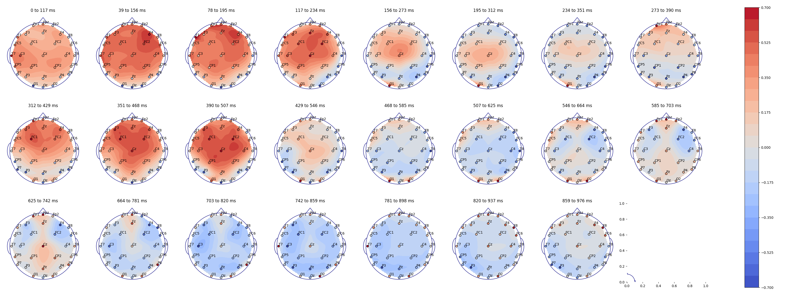
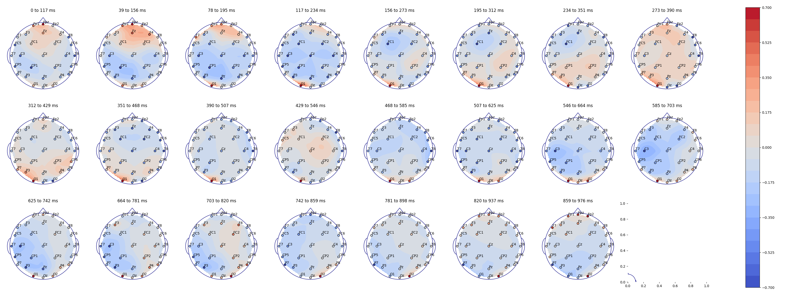
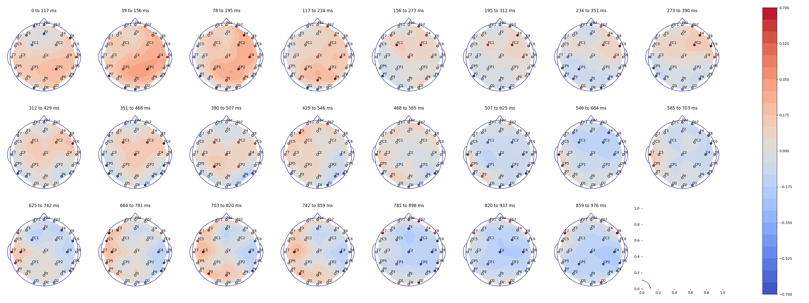

# Kiloword

## Usage
Processing and analysing kiloword dataset. The file <a id="./data/words_and_pos.csv">words_and_pos.csv</a> contains
the Part-Of-Speech, the semantic field and the tangibility for each word of the dataset. Please note that the annotation was done manually, and there can be some ambiguities concerning certain words.

## Installation and dependencies
To clone the repo:
```
    git clone https://github.com/victoria-brami/kiloword.git
```
Then installing the packages:
```
    pip install -r requirements.txt
```

## Computing correlations between words representations and brain signals

To compute the Pearson and Spearman correlations between the EEG signals and the pairwise bert distances:
```
    python3.10 -m kiloword.get_correlations --word_dist_repr bert --eeg_path <path_to_eeg_recordings> --timesteps 30 --labels_path <path_to_kiloword_labels> --save_folder <folder_name> --tab_name <csv_correlations_name>
```
To visualize the evolution of the correlations:
```
    python3.10 -m kiloword.correlations_visualisation --tab_name <csv_correlations_name>
```
Here is an example of the different plots generated
<p>
<b style="text-align:center;margin-right:8%;margin-left:5%;margin-bottom:13%;font-size:14pt;">Pearson Correlation with</b>
<b style="text-align:center;margin-right:2%;margin-left:7%;margin-bottom:13%;font-size:14pt;">Pearson Correlation with</b><br>
<b style="text-align:center;margin-right:4%;margin-left:3%;font-size:14pt;margin-top:63%;">Trained Bert word Representations</b>
<b style="text-align:center;margin-right:10%;margin-left:5%;font-size:14pt;">Random Bert word Representations</b><br><br>
    
    
</p><p>
<b style="text-align:center;margin-right:8%;margin-left:5%;margin-bottom:13%;font-size:14pt;">Pearson Correlation with</b>
<b style="text-align:center;margin-right:2%;margin-left:7%;margin-bottom:13%;font-size:14pt;">Pearson Correlation with</b><br>
<b style="text-align:center;margin-right:1%;margin-left:2%;font-size:14pt;margin-top:63%;">Levensthein-distance between words</b>
<b style="text-align:center;margin-right:10%;margin-left:6%;font-size:14pt;">Levensthein-distance between IPA words</b><br><br>
    
    
</p>


## References
<a id="https://doi.org/10.1177/0956797615603934">[1]</a> 
Stéphane Dufau, Jonathan Grainger, Katherine J. Midgley, and Phillip J. Holcomb. 
A thousand words are worth a picture: snapshots of printed-word processing in an event-related potential megastudy. 
Psychological Science, 26(12):1887–1897, 2015.
